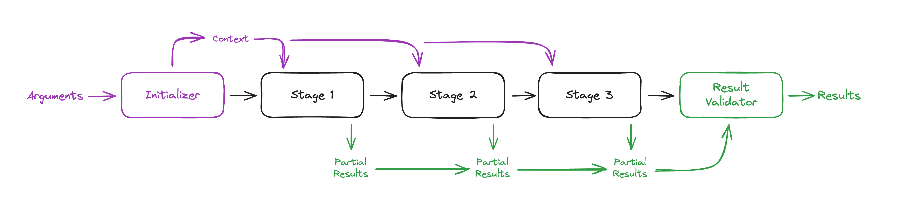

[](https://www.npmjs.com/package/@fieldguide/pipeline)

# Pipeline

A type-safe toolkit to easily compose synchronous process chains in TypeScript/JavaScript

## Table of Contents

- [Pipeline](#pipeline)
  - [Table of Contents](#table-of-contents)
  - [Overview](#overview)
  - [Installation](#installation)
  - [Types](#types)
  - [Builder](#builder)
  - [Initializer](#initializer)
  - [Stages](#stages)
    - [Stage Arguments](#stage-arguments)
    - [Stage Results](#stage-results)
  - [Results Validator](#results-validator)
  - [Middleware](#middleware)
  - [Error Handling](#error-handling)
  - [Example Use Cases](#example-use-cases)

## Overview

This library seeks to provide a structure to break down large multi-step process chains in order to make them composable and testable.



## Installation

Install the package with your favorite package manager:

```
npm install @fieldguide/pipeline
```

## Types

There are three core types to consider when constructing and using a pipeline:

1. **Arguments** represent the data that gets passed into the pipeline at runtime
2. **Context** represents the internal data that is shared with each pipeline stage
3. **Results** represent the data that is output from a pipeline execution

It is common to see these types abbreviated as `A`, `C`, and `R` respectively.

## Builder

The [pipeline builder](./src/buildPipeline.ts) is a factory that accepts the individual pieces of a pipeline and constructs a single callable of the `Pipeline` type:

```typescript
export type Pipeline<A extends object, R extends object> = (
  args: A,
) => Promise<R>;
```

Notice that the callable takes a single arguments object (`A`) and outputs a promise representing the results object (`R`). The execution context (`C`) is internal to the pipeline stages, so it is not represented in the pipeline callable constructed by the builder.

## Initializer

The **Initializer** is a method that takes in the pipeline's arguments and produces a Context object. The context is then passed as an argument into each stage.

> [!NOTE]
> The initializer should create the "empty state" of the context object. It is recommended to initialize empty arrays, sets, maps, and objects within the initializer that stages can add data to or manipulate later.

## Stages

**Stages** are the independent steps in the process chain. They are processed synchronously (one at a time, in order) until the end of the chain is reached.

As of version `0.1.0` stages can be one of two types

- PipelineStage
- PipelineStageConfiguration

`PipelineStageConfiguration` adds the ability for the user to define a `rollback` function, which should undo changes made by the `execute` function.

The pipeline can support processing a collection of stages of either type.

### Stage Arguments

The following arguments are provided to a stage when it is executed:

| Argument   | Description                                                                                                        |
| ---------- | ------------------------------------------------------------------------------------------------------------------ |
| `context`  | The execution context object setup by the initializer and manipulated by any previous stages                       |
| `metadata` | The name of the pipeline (helpful for logging/metrics) and the initial arguments provided to the pipeline callable |

### Stage Results

Each stage can return a partial results object for the pipeline. These results are collected and merged as each stage is processed. If a later stage specifies the same key in the results object as an earlier stage, the later stage's result will overwrite the earlier result.

## Results Validator

The **Results Validator** ensures that the pipeline has fulfilled the interface specified for its result. Since each stage returns a _partial_ result set, this method verifies that the entire result has been supplied.

## Middleware

If **Middleware** is specified, it will be wrapped around each stage in the pipeline. This follows [a pattern similar to Express](https://expressjs.com/en/guide/using-middleware.html). Each middleware is called in the order it is specified and includes a `next()` to call the next middleware/stage.

A middleware callback is provided the following attributes:

| Parameter      | Description                                                                   |
| -------------- | ----------------------------------------------------------------------------- |
| `context`      | The pipeline execution context object                                         |
| `metadata`     | The pipeline's metadata (name and runtime arguments)                          |
| `results`      | A read-only set of results returned by stages so far                          |
| `stageNames`   | An array of the names of the methods that make up the current pipeline stages |
| `currentStage` | The name of the current pipeline stage                                        |
| `next`         | Calls the next middleware in the stack (or the stage if none)                 |

See the [LogStageMiddlewareFactory](./src/middleware/logStageMiddlewareFactory.ts) for a simple middleware implementation. It is wrapped in a factory method so a log method can be properly injected.

```typescript
buildPipeline({
  /* ... */
  middleware: [logStageMiddlewareFactory(logger.log)],
  /* ... */
});
```

## Error Handling

When an error occurs during pipeline execution, an instance of [PipelineError](./src/error/PipelineError.ts) is thrown.

In order to decorate or extend pipeline error handling, use a standard try/catch block around pipeline invocation.

## Example Use Cases

1. [Data Export Pipeline](./docs/cases/data-export-pipeline.md)
